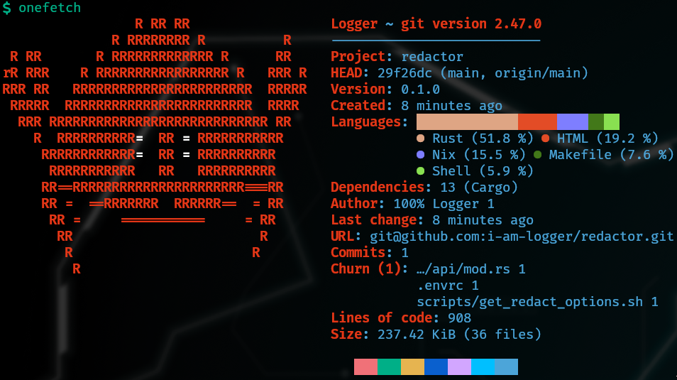

# Redactor v0.1
## utilizing NER to redact a text

by Ido Samuelson

built with : rust, nix, docker



>:warning: not redacting...yet

---

# Redactor v0.1 - REST API
### REST API
✅ [GET|PUT] /api/options 
  - downloading a model via hf-hub (✅cache, :warning: all model files?)
  - ✅ validation - will return 400 Bad Request if model doesn't support the entity type
  ```json
  { 
    "type": "ner",
    "model_name": "dslim/bert-base-NER",
    "entity_types": ["PER","ORG","LOC"]  
}
```
❌ [POST] /api/redact
- ✅ Server-Sent-Event (SSE) signature
- ❌ misuing candle-core - not sure how to load the model/tokenizer

---

# Redactor v0.1 - DEV/BUILD/RUN
### nix
✅ nix develop & cargo build/run (including candle-core)
✅ nix build/run
✅ nix build/run .#docker
❌ nix build/run .#docker + candle-core - having an internal issue

---

# Redactor v0.1 - in memory state

```rust
let data = Data::new(AppState {
    options: Arc::new(RwLock::new(None)),
    api: Arc::new(RwLock::new(None)),
}); // src/web/server.rs

pub struct AppState {
    pub options: Arc<RwLock<Option<RedactOptions>>>,
    pub api: Arc<RwLock<Option<Api>>>,
} // src/web/types.rs

#[put("/api/options")]
async fn set_options(data: Data<AppState>,json_options: Json<RedactOptions>,
) -> Result<HttpResponse, UpdateRedactError> {
    let options = json_options.into_inner();
    let mut options_guard = data.options.write().await;
    let mut api_guard = data.api.write().await;
    let api = ai::update_redact_settings(&options).await?;
    *options_guard = Some(options);
    *api_guard = Some(api);
    Ok(HttpResponse::Ok().body("Options updated"))
} // src/web/api/routes.rs
```

---

# Redactor v0.1 - Stream API (SSE)

```rust
    pub fn to_bytes_stream<S>(stream: S) -> impl Stream<Item = Result<web::Bytes, actix_web::Error>>
      where S: Stream<Item = String>,
    {
      stream.map(|text| Ok(web::Bytes::from(text)))
    } // src/utils/web.rs

    // from: src/web/api/routes.rs - redact_text
    let stream = ai::redact(api, options, text).await?;
    let bytes_stream = to_bytes_stream(stream);

    Ok(HttpResponse::Ok()
        .content_type("text/event-stream")
        .insert_header(("Cache-Control", "no-cache"))
        .streaming(bytes_stream))
```

---

# Redactor v0.1 - hugging face model download

```rust
pub async fn download_model(model: &ApiRepo) -> Result<(), DownloadModelError> {
    let tokenizer_files = [
        "model.safetensors",
        "vocab.txt",
        "tokenizer_config.json",
        "special_tokens_map.json",
    ];

    for file in tokenizer_files.iter() {
        match model.get(file).await {
            Ok(path) => info!("Downloaded '{}' to: {:?}", file, path),
            Err(e) => warn!("Failed to download optional file '{}': {}", file, e),
        }
    }

    let model_path = model.get("model.safetensors").await?;
    info!("Downloaded 'model.safetensors' to: {:?}", model_path);
    Ok(())
} // src/core/hugging_face/utils.rs
```

---

# Redactor v0.1 - Tests

```rust
    #[tokio::test]
    async fn test_redact_person() -> Result<(), RedactError> {
        let text = "John Doe met Jane Smith.";
        let options = create_ner_options(vec!["PER"]);
        let redacted_text = run_redaction(text, &options).await?;
        assert_eq!(redacted_text, "████████ met ██████████.");

        Ok(())
    } // src/core/tests.rs
``` 
---

# Redactor v0.1 - build docker

```nix

dockerImage = pkgs.dockerTools.buildImage {
  name = packageName;
  tag = packageVersion;
  created = "now";
  copyToRoot = pkgs.buildEnv {
    name = "image-root";
    paths = [ rustPackage ];
  };
  config = {
    Cmd = [
      ("/bin/" + packageName)
      ""
    ];
    volumes = {
      "/cache" = { };
    };
    Env = [
      "BIND_ADDRESS=${address}"
      "BIND_PORT=${port}"
      "RUST_LOG=info,cached_path=info,actix_server=warn,hyper=warn,reqwest=warn"
      "RUST_LOG_STYLE=always"
      "CACHE_DIR=/cache/"
    ];
    ExposedPorts = {
      "${port}/tcp" = { };
    };
  };
};

apps.docker =
  let
  script = pkgs.writeShellScriptBin "run-docker" (builtins.readFile ./scripts/run-docker.sh);
  in
  {
    type = "app";
    program = "${script}/bin/run-docker";
    args = [
      "${packageName}"
      "${packageVersion}"
      "${port}"
      "$CACHE_DIR"
    ];
  }; # flake.nix
```

---

# Redactor - Demo
